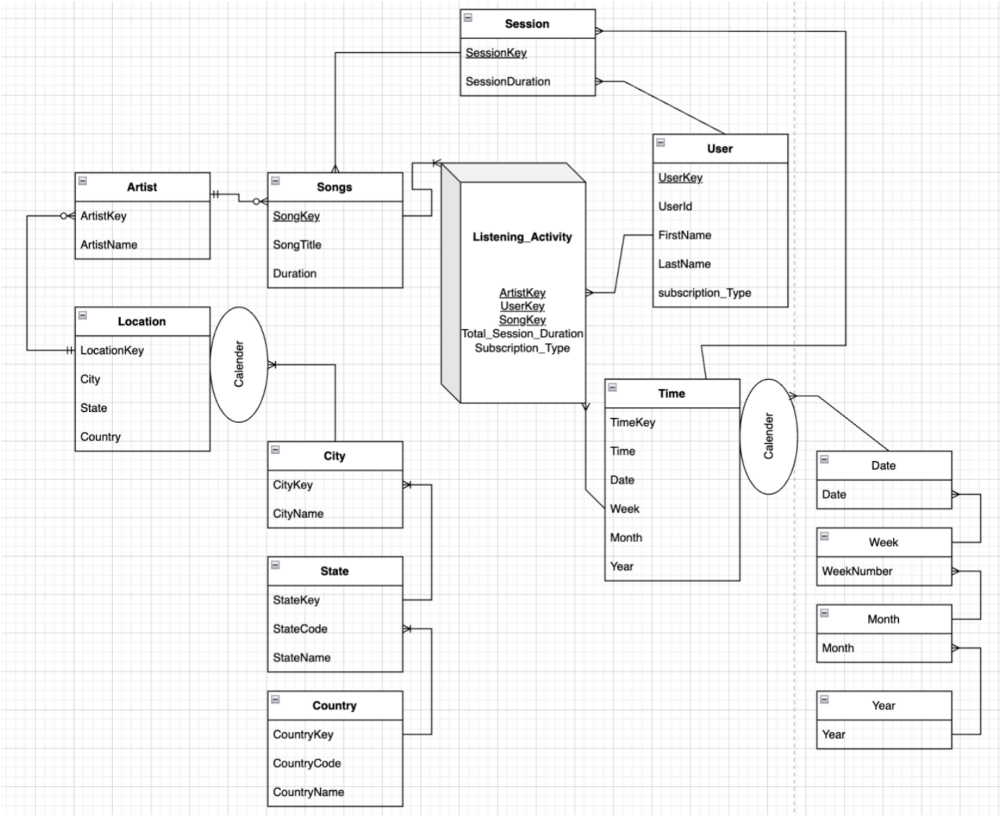
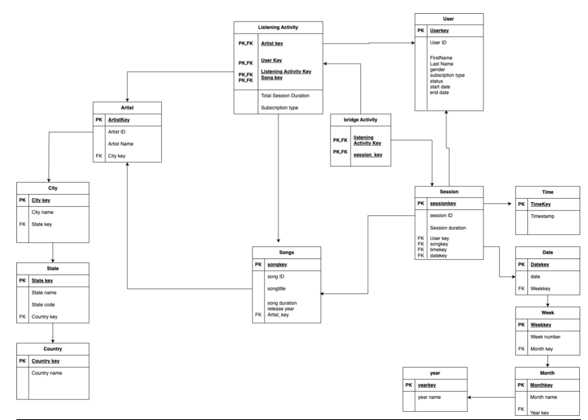
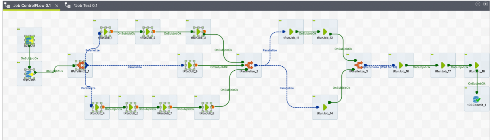
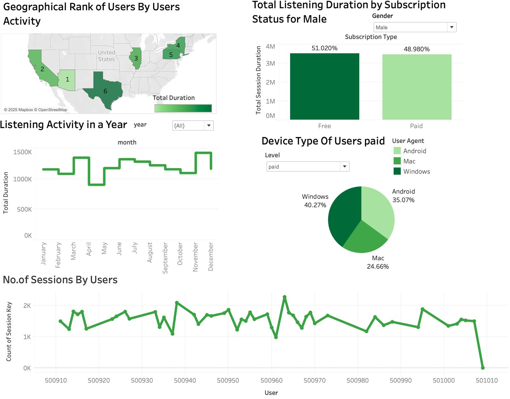

# Music Streaming Data Warehouse

## 🚀 Project Overview

This project focuses on building a **data warehouse** for analyzing user trends and behavior in music consumption. The warehouse is implemented using **PostgreSQL** and integrates multiple data sources through **Talend Studio** for ETL. The star schema design, OLAP queries, and analytical dashboards provide actionable insights for business intelligence (BI).

---

## 📌 Objectives

### Key Goals:
1. **Data Integration and Transformation**: Process user activity logs, enrich geographic data, and ensure data quality.
2. **Schema Design**: Build a star schema with a fact table (`LISTENING_ACTIVITY`) and multiple dimensions.
3. **SCD Type II Implementation**: Maintain historical records of user subscription changes.
4. **Business Intelligence Metrics**: Enable OLAP operations for insights into user behavior, geographic trends, and platform usage.

---

## 🛠️ Tech Stack

- **Database**: PostgreSQL
- **ETL Tool**: Talend Studio
- **Visualization**: Tableau
- **Languages**: SQL, Python (optional for automation)

---

## 🗂️ Project Structure

```plaintext
Music_Streaming_Data_Warehouse/
├── README.md                   # Project documentation
├── docs/                       # Documentation and diagrams
│   ├── Final_Report.pdf        # Detailed project report
│   ├── Conceptual_Model.png    # Conceptual schema diagram
│   └── Logical_Model.png       # Logical schema diagram
├── sql/                        # SQL scripts
│   ├── create_tables.sql       # Table creation scripts
│   ├── insert_data.sql         # Data insertion scripts
│   └── olap_queries.sql        # OLAP queries
├── etl/                        # ETL workflows
│   ├── Talend_Screenshots/     # Screenshots of Talend workflows
│   ├── main_etl_flow.talend    # Talend job file
│   └── supplementary_data.csv  # Sample data for testing
├── dashboard/                  # Analytical dashboards
│   ├── Tableau_Workbook.twbx   # Tableau dashboard
│   └── screenshots/            # Dashboard screenshots
└── LICENSE                     # License for the project
```

---

## 📊 Star Schema Design

### Conceptual Model


### Logical Model


### Fact Table: `LISTENING_ACTIVITY`
- **Measures**:
  - `Total_Session_Duration`: Total duration of listening sessions.
  - `Subscription_Type`: Free (0) or Paid (1).

### Dimensions:
- **UsersDim**: User details like gender, date of birth, location.
- **SongsDim**: Song metadata, including genre and artist.
- **ArtistsDim**: Artist information linked to geographic data.
- **CityDim**: Geographic details like city and state.
- **DateDim**: Temporal data for session tracking.

---

## 🔄 ETL Workflow

### Key Steps:
1. **Extract**:
   - Import raw user activity logs and metadata.
2. **Transform**:
   - Enrich data using a city-state mapping CSV.
   - Implement SCD Type II for subscription history.
3. **Load**:
   - Populate the star schema in PostgreSQL.

### Talend Workflow


---

## 📈 OLAP Queries

### Example Queries:
1. **Total Listening Duration by Subscription Type**:
   ```sql
   SELECT subscription_type, SUM(total_session_duration)
   FROM LISTENING_ACTIVITY
   GROUP BY subscription_type;
   ```

2. **Top Cities by Listening Activity**:
   ```sql
   SELECT city_name, SUM(total_session_duration) AS total_duration
   FROM LISTENING_ACTIVITY
   JOIN CityDim ON LISTENING_ACTIVITY.city_id = CityDim.city_id
   GROUP BY city_name
   ORDER BY total_duration DESC
   LIMIT 10;
   ```

---

## 📊 Analytical Dashboard

Interactive dashboards were built using **Tableau** to provide insights such as:

1. **Top Artists by Monthly Listening Duration**
2. **User Engagement by Gender and Subscription Type**
3. **Geographic Trends in Listening Activity**

### Sample Dashboard Screenshot


---

## 📌 Key Performance Indicators

1. **User Engagement**:
   - Total Listening Duration.
   - Active Users by Subscription Type.
2. **Geographic Insights**:
   - Top Cities and States by Listening Activity.
3. **Platform Usage**:
   - Listening Duration by Device Type.

---

## 🔮 Future Scope

1. **Real-Time Analytics**:
   - Implement streaming pipelines with tools like Kafka.
2. **Global Expansion**:
   - Support international data and multilingual datasets.
3. **Machine Learning**:
   - Predict user churn and recommend songs.
4. **Enhanced Dashboards**:
   - Add trend comparisons and demographic filters.

---

## 📜 License

This project is licensed under the [MIT License](LICENSE).

---

## 🤝 Contribution Guidelines

We welcome contributions! Please follow these steps:
1. Fork the repository.
2. Create a feature branch.
3. Commit your changes.
4. Push to the branch and submit a pull request.

---

Feel free to ask if you'd like assistance in customizing this `README.md` further!
